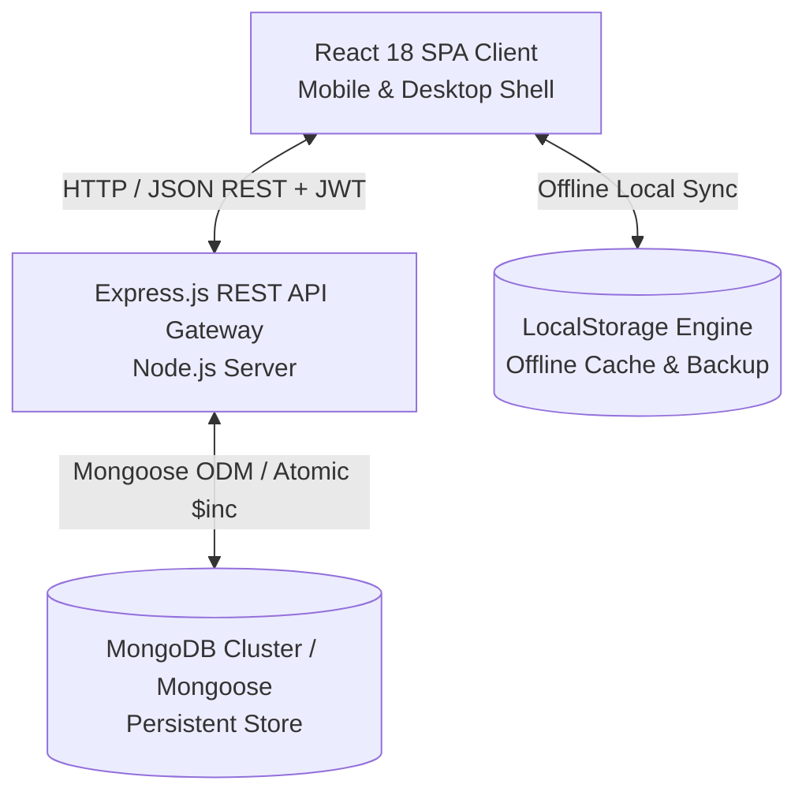
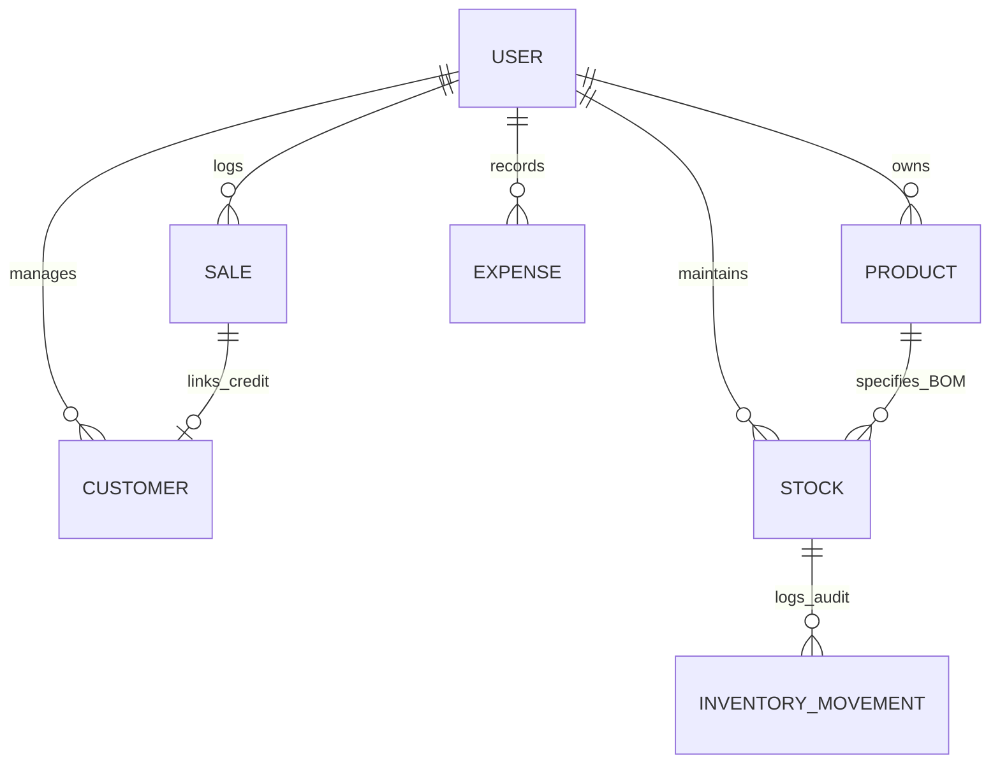

# Software Requirements Specification (SRS)
## For Startup IQ: A Full-Featured MERN Platform for Solo Makers & Growing Startups

**Document Identifier**: SRS-STARTUP-IQ-2026-V3  
**Standard**: IEEE Std 830-1998 / ISO/IEC/IEEE 29148:2018  
**Version**: 3.0.0 Production Release  
**Status**: Approved / Production-Ready  
**Date**: September 2026  
**Author**: Lead Systems Architect & Senior QA Lead  

---

## Table of Contents
1. [Introduction](#1-introduction)
   - 1.1 Purpose
   - 1.2 Scope of the System
   - 1.3 Definitions, Acronyms, and Abbreviations
   - 1.4 References
   - 1.5 Document Overview
2. [Overall Description](#2-overall-description)
   - 2.1 Product Perspective & System Topology
   - 2.2 Product Functions
   - 2.3 User Classes and Characteristics
   - 2.4 Operating Environment
   - 2.5 Design and Implementation Constraints
   - 2.6 Assumptions and Dependencies
3. [External Interface Requirements](#3-external-interface-requirements)
   - 3.1 User Interfaces & Visual Hierarchy
   - 3.2 Hardware Interfaces
   - 3.3 Software Interfaces
   - 3.4 Communications Interfaces
4. [System Features & Functional Requirements](#4-system-features--functional-requirements)
   - 4.1 Feature 1: Craft Onboarding & Domain Presets (F-01)
   - 4.2 Feature 2: Executive Dashboard & Tri-Partite Focus (F-02)
   - 4.3 Feature 3: Catalog Management & Bill of Materials (F-03)
   - 4.4 Feature 4: Raw Material Inventory & Movement Audit Log (F-04)
   - 4.5 Feature 5: Smart POS with Shortage Prevention & BOM Deduction (F-05)
   - 4.6 Feature 6: Operating Expenses & Overhead Tracking (F-06)
   - 4.7 Feature 7: Customer Credit & Receivables (Dues Management) (F-07)
   - 4.8 Feature 8: Heuristic Growth Engine & Insights (F-08)
   - 4.9 Feature 9: Sales Ledger, Search & RFC 4180 CSV Export (F-09)
   - 4.10 Feature 10: Authentication, Bcrypt Hashing & JWT Sessions (F-10)
5. [Non-Functional Requirements](#5-non-functional-requirements)
   - 5.1 Performance Requirements
   - 5.2 Safety & Data Integrity
   - 5.3 Security Requirements
   - 5.4 Software Quality Attributes (WCAG 2.1 AA Usability, Reliability)
6. [Data Architecture & Mongoose Schemas](#6-data-architecture--mongoose-schemas)
   - 6.1 Entity-Relationship Model
   - 6.2 Data Dictionaries (User, Customer, Product, Stock, InventoryMovement, Sale, Expense)
   - 6.3 Indexing Strategy
7. [Technology Mapping: Best-Fit MERN Concepts](#7-technology-mapping-best-fit-mern-concepts)
   - 7.1 MERN Concept Matrix by Functional Feature
   - 7.2 MongoDB & Mongoose Deep Dive (M)
   - 7.3 Express.js Deep Dive (E)
   - 7.4 React 18+ Deep Dive (R)
   - 7.5 Node.js Runtime Deep Dive (N)
8. [Requirements Traceability Matrix (RTM)](#8-requirements-traceability-matrix-rtm)

---

## 1. Introduction

### 1.1 Purpose
This Software Requirements Specification (SRS) establishes the complete functional, non-functional, interface, and architectural requirements for **Startup IQ** (Version 3.0.0). Startup IQ is an intelligent, full-featured MERN stack business workspace designed for solo makers, artisan entrepreneurs, home bakers, crafters, and boutique micro-enterprises.

### 1.2 Scope of the System
Startup IQ unifies Point of Sale (POS), recipe-based inventory management, customer credit receivables, operational overhead tracking, honest profit/loss calculations, and plain-language growth analytics into a cohesive, responsive web platform.

### 1.3 Definitions, Acronyms, and Abbreviations
| Term | Definition |
| :--- | :--- |
| **BOM** | Bill of Materials: the exact list and quantities of raw materials required to produce a catalog product. |
| **COGS** | Cost of Goods Sold: real material costs calculated by summing BOM component costs. |
| **Net Profit / Loss** | Gross Revenue minus Actual BOM COGS minus Operating Overhead Expenses. |
| **Due** | A transaction completed on credit where payment is deferred, creating an account receivable. |
| **Movement Audit** | A persistent log record detailing changes to stock balances with timestamp and reference reason. |
| **JWT** | JSON Web Token used for stateless, cryptographically signed user sessions. |

### 1.4 References
1. IEEE Std 830-1998: IEEE Recommended Practice for Software Requirements Specifications.
2. ISO/IEC/IEEE 29148:2018: Systems and software engineering — Requirements engineering.
3. W3C Web Content Accessibility Guidelines (WCAG) 2.1 (Level AA).
4. RFC 4180: Common Format and MIME Type for Comma-Separated Values (CSV) Files.

---

## 2. Overall Description

### 2.1 Product Perspective & System Topology
Startup IQ operates on a hybrid client-server topology:

### 2.2 Product Functions
1. **User Authentication & Multi-Tenant Isolation**: Secure registration with bcrypt hashing, token validation, and isolated workspaces.
2. **Tri-Partite Executive Dashboard**: Answers *How is my business doing?*, *What needs attention?*, and *What should I do next?*.
3. **Bill of Materials (BOM) Recipe Engine**: Links products to raw materials with automated deduction and negative inventory prevention.
4. **Receivables & Dues Settlement**: Tracks customer debt, outstanding balances, and recorded partial/full payments.
5. **Real Financial Calculation Engine**: Calculates actual COGS and honest Net Profit (including negative losses).
6. **Traceable Inventory Movements**: Every addition, sale, adjustment, and cancellation is logged into an immutable audit history.
7. **Sales Ledger & RFC 4180 CSV Export**: Transaction search, payment filtering, and one-click spreadsheet download.

---

## 3. External Interface Requirements

### 3.1 User Interfaces & Visual Hierarchy
- **Typography**: Headings in Fraunces serif; data metrics and body UI in Manrope geometric sans-serif.
- **Theming**: Warm Ivory (Daylight) and Dark Velvet (Charcoal focus mode).
- **Navigation Hierarchy**: Grouped sidebar with **Overview**, **BUSINESS** (Products, Inventory, Sales, Expenses, Customers & Dues), **INSIGHTS**, and **SETTINGS**.
- **Ergonomics**: 44px+ minimum touch targets, accessible focus indicators (`:focus-visible`), and accessible modal focus traps.

---

## 4. System Features & Functional Requirements

### 4.1 Feature 1: Craft Onboarding & Domain Presets (F-01)
- **FR-1.1**: The system shall present 7 domain presets upon initial setup (Baker, Nail Artist, Resin Artist, Painter, Tailor, Tiffin Service, Crafter).
- **FR-1.2**: Initializing a preset shall seed realistic catalog products, raw materials, customer profiles, and transaction history.

### 4.2 Feature 2: Executive Dashboard & Tri-Partite Focus (F-02)
- **FR-2.1**: The dashboard shall answer *How is my business doing?* via Gross Revenue, Net Profit/Loss, Orders Count, Inventory Asset Valuation, and Pending Receivables.
- **FR-2.2**: The dashboard shall answer *What needs attention?* via prominent clickable banners for low stock and unpaid customer credit dues.
- **FR-2.3**: The dashboard shall answer *What should I do next?* via a dedicated Quick Actions bar (Record Sale, Add Material, Log Expense, Add Product).
- **FR-2.4**: The dashboard shall display honest Net Losses in red if expenses exceed revenue without clamping to zero.

### 4.3 Feature 3: Catalog Management & Bill of Materials (F-03)
- **FR-3.1**: Each catalog item shall store name, category, price, cost price, active status, and an array of BOM recipe materials.
- **FR-3.2**: Catalog items shall display the number of linked raw materials and estimated gross profit margin.

### 4.4 Feature 4: Raw Material Inventory & Movement Audit Log (F-04)
- **FR-4.1**: Raw materials shall track name, unit, current quantity, alert threshold, unit purchase cost, and supplier.
- **FR-4.2**: The inventory view shall feature inline micro-steppers (`−`, `+1`, `+5`) for rapid stock restocking.
- **FR-4.3**: The system shall maintain an immutable `InventoryMovement` log detailing material ID, quantity delta, reason, reference ID, and timestamp.

### 4.5 Feature 5: Smart POS with Shortage Prevention & BOM Deduction (F-05)
- **FR-5.1**: Point of Sale entry shall be triggered via the desktop sidebar or mobile Floating Action Button (FAB).
- **FR-5.2**: The system shall validate stock requirements prior to committing a sale.
- **FR-5.3**: If stock is insufficient, the system shall reject the sale with a detailed breakdown (e.g. `Required: 2.0 kg · Available: 1.2 kg · Shortage: 0.8 kg`).
- **FR-5.4**: If payment method is set to "Due", the sale shall create a receivable record under the specified customer.

### 4.6 Feature 6: Operating Expenses & Overhead Tracking (F-06)
- **FR-6.1**: The system shall track operational overhead across 7 categories (Packaging, Materials, Rent, Marketing, Equipment, Delivery, Other).
- **FR-6.2**: All expenses within the selected period shall be deducted from revenue and COGS to calculate Net Profit.

### 4.7 Feature 7: Customer Credit & Receivables (Dues Management) (F-07)
- **FR-7.1**: The system shall maintain a customer directory tracking total orders, lifetime spend, and outstanding credit dues.
- **FR-7.2**: The system shall provide a payment settlement modal to record partial or full due payments with method and notes.

### 4.8 Feature 8: Heuristic Growth Engine & Insights (F-08)
- **FR-8.1**: The system shall compute rolling 30-day heuristics to identify #1 Best Seller, peak sales weekday, slow movers, and expense ratio warnings.

### 4.9 Feature 9: Sales Ledger, Search & RFC 4180 CSV Export (F-09)
- **FR-9.1**: The sales ledger shall display all transactions chronologically with live search by customer, product, or note.
- **FR-9.2**: The user shall export filtered transactions as a standard RFC 4180-compliant `.csv` file with one click.
- **FR-9.3**: Deleting a sale shall reverse stock deductions and customer due balances with an audit trail entry.

### 4.10 Feature 10: Authentication, Bcrypt Hashing & JWT Sessions (F-10)
- **FR-10.1**: The system shall support user signup with email, name, password (minimum 6 characters), business name, and craft domain.
- **FR-10.2**: Passwords shall be salted and hashed using bcrypt.
- **FR-10.3**: Authenticated requests shall pass a signed JWT Bearer token in the `Authorization` header.

---

## 5. Non-Functional Requirements

### 5.1 Performance Requirements
- **NFR-1.1**: Sub-100ms API response time under local execution.
- **NFR-1.2**: Largest Contentful Paint (LCP) under 1.2s on mobile 4G networks.
- **NFR-1.3**: Zero runtime charting overhead using native scalable SVG paths.

### 5.2 Safety & Reliability
- **NFR-2.1**: Automated fallback to in-memory store if MongoDB is not running locally.
- **NFR-2.2**: Atomic stock decrements preventing race conditions and negative inventory balances.

### 5.3 Security Requirements
- **NFR-3.1**: Bcrypt password hashing (10 salt rounds).
- **NFR-3.2**: Input validation and payload limits (2MB max) protecting against DoS.
- **NFR-3.3**: User-scoped queries ensuring tenant isolation.

### 5.4 Software Quality Attributes
- **NFR-4.1**: Full compliance with WCAG 2.1 Level AA accessibility criteria (4.5:1 text contrast, visible focus, modal focus trapping).
- **NFR-4.2**: Fluid responsiveness tested across 390px (mobile), 768px (tablet), and 1920px (desktop).

---

## 6. Data Architecture & Mongoose Schemas

### 6.1 Entity-Relationship Model

### 6.2 Data Dictionaries

#### 1. User Entity (`User.js`)
`name` (String), `email` (String, unique), `passwordHash` (String), `businessName` (String), `businessType` (String), `currency` (String), `theme` (String), `taxPreference` (String).

#### 2. Customer Entity (`Customer.js`)
`name` (String), `phone` (String), `email` (String), `totalOrders` (Number), `totalSpent` (Number), `outstandingDue` (Number), `paymentHistory` (Array of `{ date, amount, method, notes }`).

#### 3. Product Entity (`Product.js`)
`name` (String), `category` (String), `price` (Number), `costPrice` (Number), `recipe` (Array of `{ stockId, stockName, quantityNeeded, unit }`), `active` (Boolean), `order` (Number).

#### 4. Stock Entity (`Stock.js`)
`name` (String), `unit` (String), `quantity` (Number), `lowThreshold` (Number), `costPerUnit` (Number), `supplier` (String).

#### 5. InventoryMovement Entity (`InventoryMovement.js`)
`materialId` (String), `materialName` (String), `quantityDelta` (Number), `unit` (String), `reason` (`RESTOCK`, `SALE`, `SALE_REVERSAL`, `ADJUSTMENT`), `referenceId` (String), `timestamp` (Date).

#### 6. Sale Entity (`Sale.js`)
`productId` (String), `productName` (String), `quantity` (Number), `unitPrice` (Number), `amount` (Number), `costAmount` (Number), `profit` (Number), `customerName` (String), `paymentMethod` (`Cash`, `UPI`, `Card`, `Due`), `isPaid` (Boolean), `amountPaid` (Number), `outstandingBalance` (Number), `date` (Date).

#### 7. Expense Entity (`Expense.js`)
`title` (String), `category` (`Raw Materials`, `Packaging`, `Rent & Utilities`, `Marketing`, `Equipment`, `Delivery`, `Other`), `amount` (Number), `date` (Date), `notes` (String).

---

## 7. Technology Mapping: Best-Fit MERN Concepts

| Feature Module | MongoDB Concept (M) | Express.js Concept (E) | React 18 Concept (R) | Node.js Runtime (N) |
| :--- | :--- | :--- | :--- | :--- |
| **Authentication (F-10)** | Unique Index (`email: 1`), Hash Storage | Auth Middleware with Bearer Parsing | Controlled inputs, AuthModal with tabbed views | `bcryptjs` hashing & `jsonwebtoken` cryptographic signing |
| **Executive Dashboard (F-02)** | Aggregation Pipeline (`$facet`, `$group`, `$dateToString`) | Sanitized Query Handlers with Cache-Control | `useMemo` selectors, Tri-Partite layout, Interactive SVG Tooltips | Non-blocking async aggregation execution via libuv |
| **Catalog & BOM (F-03)** | Embedded Recipe Sub-document Array | RESTful Controller pattern (`/api/products`) | Bill of Materials recipe builder with live cost calculation | Efficient JSON parsing & schema validation |
| **Inventory Movements (F-04)** | Atomic Decrement (`$inc: { quantity: delta }`) | PATCH delta adjustment endpoint | Inline micro-stepper buttons (`−`, `+1`, `+5`), Movement Ledger | Real-time write dispatching with zero thread locking |
| **POS & Shortage Alert (F-05)** | Multi-Document Consistency & Atomic Updates | Shortage Validation Middleware with detailed 400 response | Real-time BOM shortage preview box, Due credit notice | Fast synchronous request-response validation |
| **Receivables & Dues (F-07)** | Secondary Index (`outstandingDue: -1`), `$inc` updates | Settle Due Endpoint (`POST /customers/:id/payment`) | Customer balance cards, payment settlement modal | Asynchronous transaction handling for customer ledger |
| **Expenses & Net Profit (F-06)**| Grouped Accumulators (`$group`, `$sum`) | Expense REST Routes (`/api/expenses`) | Category distribution chips, Net Loss alert styling | Background batch processing of financial metrics |
| **Growth Insights (F-08)** | Top-K Sorting Pipeline (`$sort`, `$limit`) | Analytics Endpoint (`/api/analytics/dashboard`) | Heuristic cards with conditional status badges | Memory-efficient execution of business heuristics |
| **Sales Ledger & Export (F-09)**| Cursor Streaming with Date Sorting (`date: -1`) | RFC 4180 CSV Response Streaming | Client Blob generation, anchor download trigger | Native Node.js `stream.Readable` pipeline |

---

## 8. Requirements Traceability Matrix (RTM)

| Req ID | Requirement Description | UI Component | Backend Controller | Database Model | Test Verification |
| :--- | :--- | :--- | :--- | :--- | :--- |
| **F-01** | Craft Onboarding & Presets | `Onboarding.jsx` | `authController.js` | `User.js` | Switch domain; verify starter catalog and stock render |
| **F-02** | Tri-Partite Dashboard | `Dashboard.jsx`, `Charts.jsx` | `analyticsController.js` | `Sale.js`, `Expense.js` | Verify Gross Revenue, honest Net Loss, and Quick Actions bar |
| **F-03** | Catalog & BOM Recipes | `Products.jsx`, `ProductModal.jsx` | `productController.js` | `Product.js` | Link materials to product; verify unit cost updates from BOM |
| **F-04** | Inventory & Movement Audit | `Stock.jsx` | `stockController.js` | `Stock.js`, `InventoryMovement.js` | Restock material; verify Movement History log entry appears |
| **F-05** | POS Shortage Prevention | `QuickAddSale.jsx` | `saleController.js` | `Sale.js`, `Stock.js` | Attempt selling with low stock; verify exact shortage warning |
| **F-06** | Operating Expenses | `Expenses.jsx` | `expenseController.js` | `Expense.js` | Log ₹850 box expense; verify Net Profit updates accurately |
| **F-07** | Customer Receivables & Dues | `Customers.jsx`, `QuickAddSale.jsx` | `customerController.js` | `Customer.js`, `Sale.js` | Record sale as "Due"; verify customer balance and settle due |
| **F-08** | Growth Heuristics | `Insights.jsx` | `analyticsController.js` | `Sale.js`, `Stock.js` | Verify Best Seller and Peak Day match 30-day data |
| **F-09** | Orders Ledger & CSV Export | `SalesLedger.jsx` | `saleController.js` | `Sale.js` | Filter by "UPI" & click "Export CSV"; verify downloaded CSV |
| **F-10** | Authentication & JWT Sessions | `AuthModal.jsx`, `Layout.jsx` | `authController.js` | `User.js` | Register new user; verify JWT session & workspace isolation |

---

**End of Software Requirements Specification**
